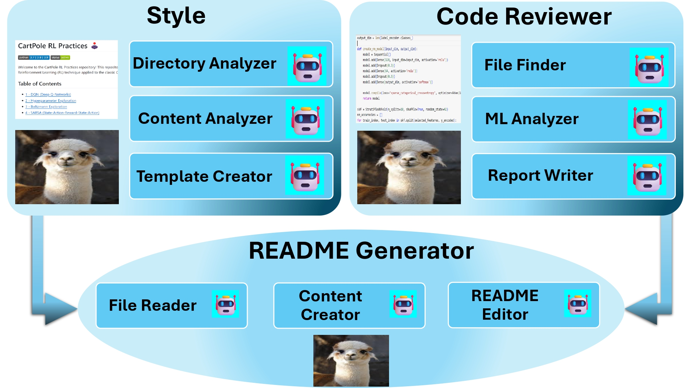

# 🚀 Automated README Generator using Multi-Agent CrewAI 🤖
[](https://colab.research.google.com/drive/1LQAnuuqdHNWhfrBc6KH03WDKyTlc4AeR?usp=sharing)


Creating the perfect README has always been a crucial part of any project. It's the first impression developers and collaborators get from your repository. However, crafting a well-structured, detailed, and visually appealing README takes time and effort. That's why I decided to automate this process using **CrewAI** and **LLaMA 3 - 70B**.

The core of this system revolves around **three collaborative crews**:
1. **Style Crew**: This crew analyzes a sample README that reflects my preferred style, such as the one from [RL Practices - DQN](https://github.com/MahanVeisi8/RL_practices/tree/main/Cartpole/1%20-%20DQN).
2. **Code Crew**: This crew digs deep into the project code, like in [Readahead Optimization using ML Models](https://github.com/MahanVeisi8/Readahead-Optimization-Using-ML-Models), extracting key information to ensure the README is accurate and thorough.
3. **README Generator Crew**: Combining insights from the Style and Code Crews, this team writes the final README, complete with structure, details, and creative touches.

The project overview below demonstrates how the three crews work together, processing inputs like sample READMEs and source code, powered by **CrewAI** and the powerful **LLaMA 3 - 70B** model.



With this setup, I’ve automated the task of producing top-quality, personalized READMEs that align perfectly with my style preferences—making the process faster, consistent, and fun!


## 🧠 **LLM Setup and Agents**

This project leverages the powerful **LLaMA 3 - 70B** language model to analyze and generate natural language content. By using a combination of Langchain and CREW AI, we've broken down the README creation task into smaller, manageable steps, allowing each crew to handle specific responsibilities.

### **Why LLaMA 3 - 70B?**
LLaMA 3 - 70B strikes a balance between computational efficiency and power, making it an ideal choice for natural language tasks without the overhead of more expensive models like GPT-4. Although we could have used stronger models, **LLaMA 3 - 70B** provides impressive results in the free tier, making it accessible and powerful for most documentation tasks.

> *Note*: Some of the more powerful paid LLMs include GPT-4, Claude, and PaLM 2, but for this project, we focused on a cost-efficient solution without compromising quality.

### **Setting Up the LLM**

To get the LLM working, we initialize it using the **Langchain** and **CREW AI** integration. The model handles natural language processing (NLP) tasks such as reading content, understanding code structure, and generating readable documentation.

```bash
pip install --upgrade langchain langchain_core crewai langchain_groq
```

Set up the **GROQ API Key** environment variable:
```python
import os
os.environ["GROQ_API_KEY"] = "your-key-here"
```

---

## 🤖 **CREW AI: Agents and Their Roles**

To automate the creation of the README, the project divides tasks among three specialized agents—each responsible for a distinct aspect of the documentation process. Here’s a breakdown:

### 1. **Style Crew** 📝
The Style Crew ensures that the generated README matches the preferred style by analyzing a sample README provided by the user. In this case, we used the README from [RL Practices - DQN](https://github.com/MahanVeisi8/RL_practices/tree/main/Cartpole/1%20-%20DQN).

- **Directory Analyzer**: Scans the directories to locate the README.md files for analysis.
- **Content Analyzer**: Reads and extracts the style, structure, and key elements from the sample README.
- **Template Creator**: Based on the analysis, this agent generates a reusable README template, which serves as a skeleton for the final output.

Sample Output from the Style Crew:
```
# Introduction

This repository provides a comprehensive implementation of [Project Name], a [brief description of the project]. The project aims to [briefly describe the project's objective].
...
```

---

### 2. **Code Crew** 💻
The Code Crew dives into the project's codebase to extract technical details that need to be documented in the README. This crew ensures that important components like algorithms, functions, and models are clearly described.

- **File Finder**: Identifies relevant code files and passes them to the next agent for analysis.
- **ML Analyzer**: Reads and analyzes machine learning methods and their implementation in the code.
- **Report Writer**: Generates a structured report based on the analysis, which is then included in the README.

For example, in the case of [Readahead Optimization using ML Models](https://github.com/MahanVeisi8/Readahead-Optimization-Using-ML-Models), this crew extracted key details about the model training process and important results.

---

### 3. **README Generator Crew** 📄
This final crew is responsible for combining the findings from both the Style and Code Crews to generate a polished README.

- **File Reader**: Reads the output from the Style and Code Crews to merge content.
- **Content Merger**: Combines the style template with the technical content to produce a coherent and structured README draft.
- **README Editor**: Finalizes the draft by adding creative touches like emojis, formatting enhancements, and technical precision.

---

### **🚀 Running the Crews**

The entire process is automated and implemented in **Google Colab** for easy use. Simply run the notebook, and the crews will work together to generate your README.

```bash
git clone https://github.com/your-repo/automated-readme-generator.git
pip install -r requirements.txt
```

Once the agents complete their tasks, you’ll have a professional README ready to go, saving hours of manual work.

---

This section sets the stage for discussing the final outputs (such as showing the `style_found_output.txt` and `FINAL_README.md` files) and will smoothly lead into discussing the result of the style analysis and the final README generated by the crews.


## 🤖 How CrewAI Works

The automated README generator employs **CrewAI** agents, each with specialized roles:

### 1. Analyzing Style 📝

The **Style Analyzer Agent** learns the desired structure and style from past READMEs (e.g., [RL Practices](https://github.com/MahanVeisi8/RL_practices/tree/main/Cartpole/1%20-%20DQN)). This allows the generated README to align with specific formatting and tone preferences.

### 2. Code Structure Review 💻

The **Code Review Agent** reads through the repository's code, especially projects like [Readahead Optimization using ML Models](https://github.com/MahanVeisi8/Readahead-Optimization-Using-ML-Models), to extract the essential technical details for inclusion in the README.

### 3. Generating README 📄

The **README Generator Agent** merges the findings from the style and code analysis, formatting the final README. It ensures the documentation is coherent, professional, and—let's not forget—fun with emojis and creative elements!

---

## 📄 Sample README Output

Here’s an example of the README generated by CrewAI:

### Final README Content: 

```md
Final README Content:  Here is the rewritten README file:

# Optimizing Readahead Feature of Linux Page Cache using Machine Learning 📊💻

This repository provides a comprehensive implementation of optimizing the Readahead feature of the Linux Page Cache under varying workloads using machine learning techniques.

## Setup 💻

### Prerequisites

* Python version: 3.x
* Libraries: scikit-learn, numpy, pandas, etc.
* Installation instructions: `pip install -r requirements.txt`

### Environment Setup

* Create a virtual environment: `python -m venv env`
* Activate the virtual environment: `source env/bin/activate`

## Implementing Machine Learning Components 🤖

### Feature Importance Analysis

* Brief description: Random Forest Classifier was used to analyze feature importance, and non-important features were removed.
* Code snippet or example: [Insert code snippet]
* Explanation of the component's functionality: This component is used to identify the most important features that affect the Readahead size.

### Dimensionality Reduction

* Brief description: T-SNE was used to visualize the data in 2D.
* Code snippet or example: [Insert code snippet]
* Explanation of the component's functionality: This component is used to reduce the dimensionality of the data and visualize it in 2D.

### Model Training 🚀

* **Neural Network**
	+ Brief description: MLPClassifier was used with hidden layers of 64 and 32 neurons.
	+ Code snippet or example: [Insert code snippet]
	+ Explanation of the component's functionality: This component is used to train a neural network model to classify workload types and suggest optimal Readahead sizes.
* **Decision Tree**
	+ Brief description: DecisionTreeClassifier was used.
	+ Code snippet or example: [Insert code snippet]
	+ Explanation of the component's functionality: This component is used to train a decision tree model to classify workload types and suggest optimal Readahead sizes.
* **Random Forest**
	+ Brief description: RandomForestClassifier was used with 100 estimators.
	+ Code snippet or example: [Insert code snippet]
	+ Explanation of the component's functionality: This component is used to train a random forest model to classify workload types and suggest optimal Readahead sizes.

## Results and Performance Analysis 📊

### Model Comparison

| Model            | Accuracy  | Notes                                       |
|------------------|-----------|---------------------------------------------|
| Decision Tree    | 100.00%   | Simple, interpretable, perfect accuracy     |
| Neural Network   | 99.85%    | High accuracy, complex model with slight variability in precision |
| Random Forest    | 100.00%   | Combines multiple trees for perfect accuracy and generalization |

### Performance Comparison

* The results show that both the Decision Tree and Random Forest models achieved perfect accuracy, while the Neural Network model had a slightly lower accuracy.

## Summary 📚

This project provides a comprehensive implementation of optimizing the Readahead feature of the Linux Page Cache under varying workloads using machine learning techniques, demonstrating the effectiveness of machine learning techniques in optimizing the Readahead feature under varying workloads. The results show that the Random Forest model stands out for its combination of accuracy and interpretability, making it a strong candidate for real-time systems that require dynamic adjustment of Readahead sizes based on current workloads.
Final README saved to: FINAL_README.md
```

*For the complete output, check out the file [FINAL_README.md](FINAL_README.md)*

---

## 📊 Results

This project demonstrated that AI-based automation tools, such as **CrewAI**, can effectively generate high-quality documentation with minimal manual intervention. The generated README files are not only accurate but also engaging, visually appealing, and professional.

---

## 🔚 Conclusion

With **CrewAI**, writing complex, structured documentation becomes fully automated, saving time and maintaining high-quality standards. This system is perfect for projects like [Readahead Optimization](https://github.com/MahanVeisi8/Readahead-Optimization-Using-ML-Models), where extensive technical details need to be documented alongside a preferred style. 
